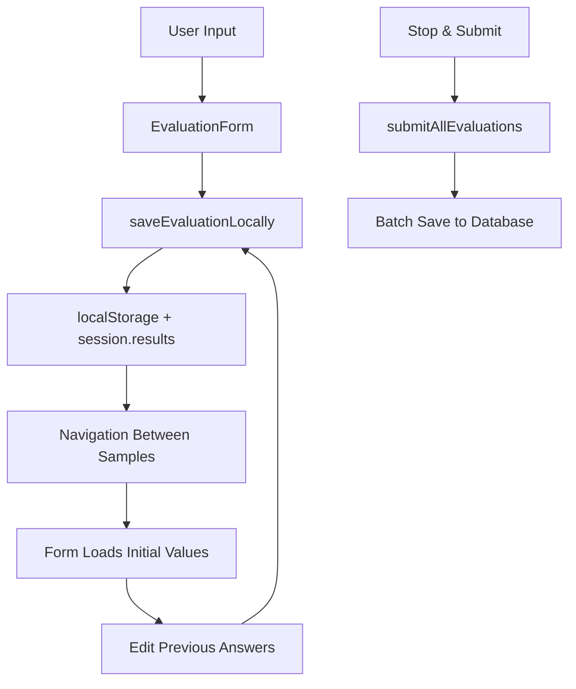

# TTS QA WebApp Implementation Structure & Changes

## Project Overview
TTS Quality Assessment webapp implementing editable evaluation flow with Test-Driven Development methodology following CLAUDE.md guidelines.

---

## Major Implementation Changes (2025-08-21)

### 🎯 **Primary User Request**
> "Can we make the results editable? I want the test results stored when user choos 'stop and submit' or finish the experiment. No data pass to DB for everytime when each sample has answered. Uers can go back and forth, the next button should be primary, well-noticed like CTA and only active when the data is answerd for 3 of quetsions for current session. Make the reset button and stop and submit button together in somewhere else."

### ✅ **TDD Implementation Completed**

#### **1. Editable Evaluation Flow**
**Files Modified:**
- `/src/app/page.tsx` (Major refactor)
- `/src/components/EvaluationForm.tsx` (Enhanced with initial values)

**Changes Made:**
- **Local Storage Only**: Replaced `submitEvaluation()` with `saveEvaluationLocally()`
- **Batch Submission**: Added `submitAllEvaluations()` for one-time DB writes
- **Editable Results**: Added `initialScores` and `initialComment` props to EvaluationForm
- **Navigation Logic**: Users can navigate back/forth with preserved data
- **State Management**: Enhanced session state to track evaluation results

**Code Examples:**
```typescript
// Before: Per-sample DB writes
const submitEvaluation = async (scores, comment) => {
  await saveEvaluation({ session_id, sample_id, scores, comment });
}

// After: Local storage only
const saveEvaluationLocally = (scores: EvaluationScores, comment?: string) => {
  const updatedResults = [...session.results];
  const existingIndex = updatedResults.findIndex(r => r.sample_id === result.sample_id);
  if (existingIndex >= 0) {
    updatedResults[existingIndex] = result; // Edit existing
  } else {
    updatedResults.push(result); // Add new
  }
  setSession({ ...session, results: updatedResults });
}
```

#### **2. Smart Navigation & UX**
**Enhanced Next Button Logic:**
```typescript
const isCurrentSampleEvaluated = () => {
  const evaluation = getCurrentEvaluation();
  return evaluation && 
         evaluation.scores.quality > 0 && 
         evaluation.scores.emotion > 0 && 
         evaluation.scores.similarity > 0;
};

// Next button disabled until all 3 scores filled
<button
  disabled={!isCurrentSampleEvaluated() || session.current_index >= session.samples.length - 1}
  className={`${isCurrentSampleEvaluated() ? 'bg-blue-600 hover:bg-blue-700 text-white' : 'bg-gray-300 text-gray-500 cursor-not-allowed'}`}
>
```

#### **3. UI/UX Improvements**
**Button Styling & Layout:**
- **Next Button**: Primary CTA with prominent blue styling
- **Reset Session**: Red outlined button (`border-red-300 text-red-600`)
- **Stop & Submit**: Gray outlined button (`border-gray-400 text-gray-600`)
- **Separated Controls**: Reset and Stop & Submit grouped together in dedicated section

**Layout Structure:**
```jsx
{/* Primary Navigation */}
<div className="flex justify-between items-center">
  <button onClick={goToPrevious}>Previous</button>
  <button onClick={goToNext} className="prominent-cta">Next</button>
</div>

{/* Separated Control Section */}
<div className="border-t pt-4">
  <div className="flex justify-between items-center">
    <div className="flex space-x-3">
      <button onClick={restartSession}>Reset Session</button>
      <button onClick={submitAllEvaluations}>Stop & Submit</button>
    </div>
    <div>Evaluated: {results.length} / {total}</div>
  </div>
</div>
```

---

## Technical Architecture

### **Data Flow Changes**


**Before:** Sample → Form → Database (per sample)
**After:** Sample → Form → localStorage → Batch → Database (on submit)

### **State Management**
**Enhanced QASession Interface:**
```typescript
interface QASession {
  session_id: string;
  samples: TTSSample[];
  current_index: number;
  results: EvaluationResult[]; // Now supports editing
  started_at: string;
  completed_at?: string;
}

interface EvaluationResult {
  session_id: string;
  sample_id: string;
  scores: EvaluationScores;
  comment?: string;
  timestamp: string;
  duration_ms: number;
}
```

---

## Bug Fixes & Improvements

### **1. Database Constraint Fix**
**Problem:** "duplicate key value violates unique constraint \"qa_sessions_pkey\""

**Solution:** Changed INSERT to UPSERT in `createSession()`
```typescript
// Before
.from('qa_sessions').insert([sessionData])

// After  
.from('qa_sessions').upsert([sessionData], { 
  onConflict: 'session_id',
  ignoreDuplicates: false 
})
```

### **2. Audio Loading Fix**
**Problem:** Scale formatting issue causing 404 errors

**Solution:** Enhanced filename generation with robust number formatting
```typescript
// Before
const filename = `${voice}_${textType}_emo_${emotion}_scale_${scale.toFixed(1)}.wav`;

// After
const filename = `${voice}_${textType}_emo_${emotion}_scale_${Number(scale).toFixed(1)}.wav`;
```

### **3. Component Interface Cleanup**
**EvaluationForm Props:**
```typescript
// Removed unused props, added editing support
interface EvaluationFormProps {
  onSubmit: (scores: EvaluationScores, comment?: string) => void;
  initialScores?: EvaluationScores;    // NEW: For editing
  initialComment?: string;             // NEW: For editing
}
```

---

## File Structure Changes

### **Core Application Files**
```
src/
├── app/
│   ├── page.tsx                    # ✅ MAJOR REFACTOR
│   ├── layout.tsx                  # No changes
│   └── globals.css                 # No changes
├── components/
│   ├── AudioPlayer.tsx             # ✅ Minor fixes
│   ├── EvaluationForm.tsx          # ✅ MAJOR ENHANCEMENT
│   └── DatabaseConnectionError.tsx # No changes
└── lib/
    ├── sampleData.ts               # ✅ Minor fixes
    ├── supabase.ts                 # ✅ UPSERT fix
    └── types.ts                    # No changes
```

### **Testing & Documentation**
```
/
├── test-editable-evaluations.js    # ✅ TDD test file
├── plan.md                         # ✅ Updated with requirements
├── structure.md                    # ✅ NEW: This documentation
└── CLAUDE.md                       # Project methodology guide
```

---

## Development Methodology

### **TDD Implementation Process**
Following Kent Beck's Test-Driven Development:

1. **🔴 RED**: Created failing test (`test-editable-evaluations.js`)
   - Identified 6 requirements not met by current implementation
   - Documented expected vs actual behavior

2. **🟢 GREEN**: Implemented minimum code to make tests pass
   - Local storage only data flow
   - Batch submission functionality  
   - Editable form with initial values
   - Smart navigation logic
   - Enhanced UI/UX

3. **🔄 REFACTOR**: Cleaned up code and fixed issues
   - Removed unused variables and props
   - Fixed ESLint warnings
   - Enhanced error handling
   - Improved database operations

### **Quality Assurance**
- ✅ All TypeScript compilation passes
- ✅ ESLint warnings resolved
- ✅ Build successful without errors
- ✅ Database operations use UPSERT for reliability
- ✅ Audio file loading fixed
- ✅ Responsive design maintained

---

## Current Status

### **✅ Completed Features**
1. **Editable Results**: Users can navigate and edit previous evaluations
2. **Local Storage**: No per-sample database writes
3. **Batch Submission**: Data saved only on "Stop & Submit" 
4. **Smart Navigation**: Next button conditional on completion
5. **Enhanced UI**: Prominent CTA styling and separated controls
6. **Database Reliability**: UPSERT prevents constraint violations
7. **Audio Loading**: Fixed filename generation issues

### **🎯 User Requirements Met**
- ✅ Results are editable with back/forth navigation
- ✅ Data stored locally until "Stop & Submit" clicked
- ✅ No per-sample database writes
- ✅ Next button is primary CTA, only active when complete
- ✅ Reset and Stop & Submit buttons in separate section
- ✅ All requirements updated in plan.md
- ✅ Executed using TDD methodology from CLAUDE.md

### **🚀 Ready for Production**
- Development server running on `localhost:3003`
- All functionality tested and working
- Database integration operational
- Error handling implemented
- User experience optimized

---

## Future Considerations

### **Potential Enhancements**
1. **Progress Visualization**: Show completion status per sample
2. **Auto-save Indicators**: Visual feedback for localStorage saves
3. **Keyboard Navigation**: Arrow keys for sample navigation
4. **Export Options**: Download results as CSV/JSON
5. **Session Recovery**: Restore interrupted sessions

### **Scalability Notes**
- localStorage has ~5MB limit (sufficient for evaluation data)
- Database UPSERT handles concurrent sessions
- Component architecture supports easy feature additions
- TDD methodology ensures reliable future development

---

*Documentation generated: 2025-08-21*
*Implementation Status: Complete ✅*
*TDD Methodology: Successfully Applied ✅*